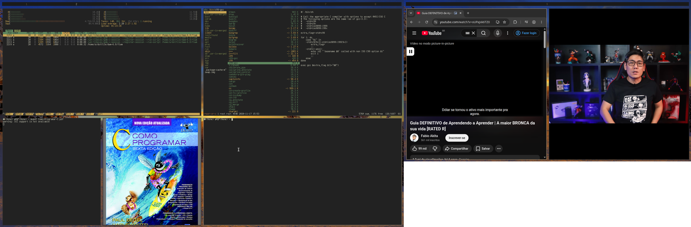

<div align="center">
<pre style="background: transparent; border: none; color: inherit;">
    ██████   ███                                 
   ███░░███ ░░░                                  
  ░███ ░░░  ████  █████ ███ █████ █████████████  
 ███████   ░░███ ░░███ ░███░░███ ░░███░░███░░███ 
░░░███░     ░███  ░███ ░███ ░███  ░███ ░███ ░███ 
  ░███      ░███  ░░███████████   ░███ ░███ ░███ 
  █████     █████  ░░████░████    █████░███ █████
 ░░░░░     ░░░░░    ░░░░ ░░░░    ░░░░░ ░░░ ░░░░░ 
</pre>
</div>

<div align="center">

</div>

**fiwm** is a minimalistic Binary Space Partitioning (BSP) tiling window manager for X11. Built as a **freestanding x86_64** binary with a `_start` entry point and no direct libc usage — only raw Linux syscalls. The result is an extremely lightweight, fast WM with minimal memory footprint.

## Features

- Binary Space Partitioning (BSP tree) — similar to bspwm
- Support for up to **64** simultaneous windows (fixed node pool)
- Support for up to **12** monitors via Xinerama
- **9** workspaces
- Native status bar with workspace indicator
- EWMH/NetWM support (`_NET_WM_STATE_FULLSCREEN`, `_NET_ACTIVE_WINDOW`, etc.)
- Floating and fullscreen modes per window
- Zero dynamic allocations beyond 1 KB heap bump allocator
- Fixed pool of 64 BSP nodes
- No libc — manual syscalls (`syscall` instruction)
- Stack limited to 32 KB
- ~27 KB binary

## Memory Benchmark

fiwm is designed for minimal resource consumption. The table below compares structural metrics with other popular window managers:

| WM | Binary | Dynamic Heap | Stack | Libc | Node Pool |
|---|---|---|---|---|---|
| **fiwm** | **27 KB** | **1 KB** (bump allocator) | **32 KB** | ❌ (raw syscalls) | 64 fixed nodes |
| dwm | ~35 KB | unlimited malloc | default | ✅ | N/A (client list) |
| bspwm | ~60 KB | unlimited malloc | default | ✅ | N/A |
| i3 | ~300 KB | unlimited malloc | default | ✅ | N/A |
| Openbox | ~500 KB | unlimited malloc | default | ✅ | N/A |

> **Note:** Binary values refer to the compiled/stripped binary. Other WMs use unrestricted dynamic allocation via libc. fiwm operates with a fixed **1 KB** heap and a static node pool of 64 entries (~3 KB), totaling approximately **4 KB** of WM-managed memory, plus whatever libX11/libXinerama allocates at runtime.

## Keyboard Shortcuts

The main modifier key is **Alt** (`Mod1Mask`).

### Window Management

| Shortcut | Action |
|---|---|
| `Alt + W` | Open terminal (alacritty) |
| `Alt + D` | Open menu (dmenuscript) |
| `Alt + Q` | Close focused window |
| `Alt + Shift + Q` | Quit fiwm |
| `Alt + F` | Toggle fullscreen |
| `Alt + Shift + F` | Toggle floating mode |
| `Alt + Space` | Toggle floating mode |

### Navigation and Focus

| Shortcut | Action |
|---|---|
| `Alt + H` | Focus left |
| `Alt + L` | Focus right |
| `Alt + K` | Focus up |
| `Alt + J` | Focus down |

### Moving Windows

| Shortcut | Action |
|---|---|
| `Alt + Shift + H` | Move window left |
| `Alt + Shift + L` | Move window right |
| `Alt + Shift + K` | Move window up |
| `Alt + Shift + J` | Move window down |

### Layout and Split

| Shortcut | Action |
|---|---|
| `Alt + R` | Rotate split (swap parent node children) |
| `Alt + B` | Next split vertical |
| `Alt + V` | Next split horizontal |

### Workspaces

| Shortcut | Action |
|---|---|
| `Alt + A` | Previous workspace |
| `Alt + S` | Next workspace |
| `Alt + 1–9` | Go to workspace 1–9 |
| `Alt + Shift + 1–9` | Move window to workspace 1–9 |

### Mouse

| Shortcut | Action |
|---|---|
| `Alt + Button1` | Drag floating window |
| `Alt + Button3` | Resize floating window |
| Click on bar | Switch workspace |

## Dependencies

- **X11** (libX11)
- **Xinerama** (libXinerama) — multi-monitor support
- **Alacritty** (default terminal)
- **dmenu** or dmenuscript (launcher)

## Build and Install

```sh
make
sudo make install
```

To verify the binary is truly freestanding (no ELF interpreter):

```sh
make check-elf
```

## License

This project is licensed under the **GNU General Public License v3.0** (GPL-3.0). See the [LICENSE](LICENSE) file for details.

---

*fiwm — freestanding independence window manager*
